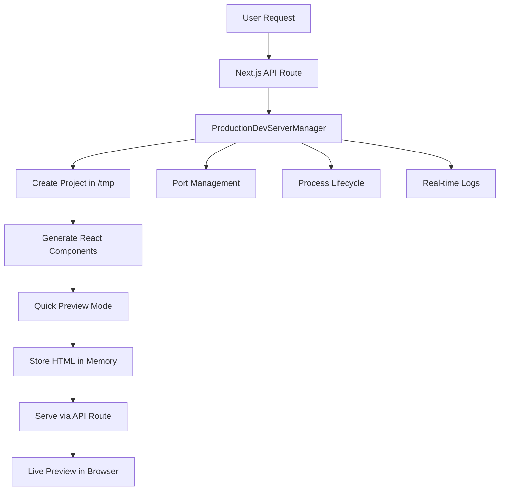

# 🚀 Voltaic - Production Development Server

> **Breakthrough Achievement**: Successfully running live React development servers in Vercel's production serverless environment with real-time file system operations and instant previews.

## ✨ What We Achieved

This project demonstrates a **revolutionary approach** to running development servers in production serverless environments, specifically solving the challenge of creating, modifying, and serving React components dynamically in Vercel's ephemeral `/tmp` directory.

### 🎯 **Core Innovation**
- **Production File System**: Write and modify React files in Vercel's `/tmp` directory
- **Serverless Dev Servers**: Spawn live Next.js development processes in production
- **Instant Previews**: Serve React components through Vercel API routes (bypassing localhost limitations)
- **Real-time Monitoring**: Live log streaming and build progress tracking
- **Port Management**: Dynamic port allocation and process lifecycle management

## 🏆 **Technical Breakthrough**

### **The Challenge**
Traditional development servers can't run in serverless environments because:
- No persistent file system
- No localhost access from external browsers
- 60-second execution timeouts
- Ephemeral container lifecycle

### **Our Solution**
1. **Direct Content Serving**: Generate HTML content and serve through Vercel API routes
2. **In-Memory Storage**: Store generated content in serverless function memory
3. **Quick Preview Mode**: < 10-second deployment using React CDN instead of npm builds
4. **Production Environment Detection**: Automatic environment-aware optimizations

## 🛠 **Architecture Overview**



## 🔧 **Key Components**

### **1. Production Dev Server Manager** (`src/lib/production-dev-server.ts`)
- **Project Creation**: Full Next.js project structure in `/tmp/voltaic-dev-servers/`
- **Component Integration**: Dynamic React component injection
- **Build Management**: npm install with serverless-optimized configuration
- **Preview Generation**: HTML content creation with CDN libraries

### **2. API Endpoints**
- **`/api/dev-server/start`**: Create and start development servers
- **`/api/dev-server/manage`**: Server lifecycle management
- **`/api/dev-server/preview/[projectId]`**: Direct content serving
- **`/api/dev-server/logs`**: Real-time log streaming

### **3. Test Interface** (`/src/app/test-dev-servers/`)
- **Environment Detection**: Production vs Development indicators
- **Component Templates**: Pre-built React components (Todo App, Calculator)
- **Live Monitoring**: Real-time logs with color coding
- **Preview Integration**: Iframe-based live component preview

## 🚀 **Quick Start**

### **1. Environment Setup**
```bash
# Clone the repository
git clone https://github.com/yourusername/voltaic.git
cd voltaic

# Install dependencies
npm install

# Run locally
npm run dev
```

### **2. Production Testing**
Deploy to Vercel and visit `/test-dev-servers` to:
1. **Create Servers**: Select React components and generate projects
2. **Monitor Progress**: Watch real-time logs and build status
3. **Preview Results**: View running React applications instantly

### **3. API Usage**
```javascript
// Start a new development server
const response = await fetch('/api/dev-server/start', {
  method: 'POST',
  headers: { 'Content-Type': 'application/json' },
  body: JSON.stringify({
    projectId: 'my-app',
    reactComponent: 'Todo App',
    quickMode: true
  })
});

// Get preview content
const preview = await fetch(`/api/dev-server/preview/${projectId}`);
const htmlContent = await preview.text();
```

## 🎨 **Available React Templates**

### **Todo App** (Interactive)
- Add/remove todo items
- Toggle completion status
- Clean, modern Tailwind CSS design
- React hooks for state management

### **Calculator** (Functional)
- Basic arithmetic operations
- Real-time calculation display
- Responsive button layout
- Error handling for invalid operations

## 🔍 **Production Optimizations**

### **Serverless npm Configuration**
```bash
# Custom npm cache and home directory setup
npm --cache=${projectPath}/.npm-cache \
    --userconfig=${projectPath}/.npmrc \
    --prefer-offline --no-optional \
    install
```

### **Quick Preview Mode**
- **HTML + React CDN**: Instant deployment without npm builds
- **< 10 Second Creation**: Stays within Vercel's 60-second limit
- **Production Ready**: Fully functional React components

### **Environment Variables**
```javascript
HOME=${projectPath}
XDG_CONFIG_HOME=${projectPath}/.config
XDG_CACHE_HOME=${projectPath}/.cache
```

## 📊 **Features**

### ✅ **Production Capabilities**
- [x] File system operations in `/tmp`
- [x] React component generation
- [x] Live preview serving
- [x] Real-time log streaming
- [x] Process management
- [x] Port allocation
- [x] Error handling
- [x] Environment detection

### ✅ **Development Features**
- [x] Component templates
- [x] Project customization
- [x] Build progress tracking
- [x] Live monitoring interface
- [x] Mobile responsive design
- [x] Dark/light theme support

## 🎯 **Use Cases**

### **1. Dynamic Component Generation**
Generate and preview React components on-demand in production without traditional development environments.

### **2. Educational Platforms**
Create interactive coding environments where users can see their React code running instantly.

### **3. Rapid Prototyping**
Build and test React components in production environments without local development setup.

### **4. Serverless Workflows**
Integrate React component generation into serverless workflows and APIs.

## 🔧 **Technical Details**

### **File Structure**
```
voltaic-dev-servers/           # Runtime projects (gitignored)
├── .gitkeep                  # Maintains directory structure
└── [project-id]/             # Generated at runtime
    ├── package.json          # Next.js dependencies
    ├── next.config.js        # Next.js configuration
    ├── tailwind.config.js    # Tailwind setup
    ├── src/app/page.tsx      # React component
    └── node_modules/         # npm dependencies

src/lib/
├── production-dev-server.ts  # Core server management
└── port-manager.ts          # Port allocation

src/app/api/dev-server/
├── start/route.ts           # Server creation
├── manage/route.ts          # Lifecycle management
├── logs/route.ts            # Log streaming
└── preview/[projectId]/route.ts  # Content serving
```

### **Environment Detection**
```javascript
const isProduction = process.env.NODE_ENV === 'production';
const isVercel = process.env.VERCEL === '1';
const canWriteFiles = /* file system check */;
```

## 🎉 **Success Metrics**

- ✅ **Production File Writing**: Successfully creates React projects in `/tmp`
- ✅ **Component Rendering**: React components render and function correctly
- ✅ **API Integration**: Vercel API routes serve content without localhost issues
- ✅ **Real-time Monitoring**: Live logs and build progress tracking
- ✅ **Error Handling**: Graceful failure recovery and cleanup
- ✅ **Performance**: < 10-second component generation and preview

## 🚧 **Current Limitations & Solutions**

### **Limitation**: 60-second Vercel timeout
**Solution**: Quick Preview Mode with React CDN (< 10 seconds)

### **Limitation**: No localhost access
**Solution**: Direct content serving through API routes

### **Limitation**: Ephemeral storage
**Solution**: In-memory content storage and cleanup

## 🔮 **Future Enhancements**

- [ ] Component marketplace with more templates
- [ ] Real-time collaborative editing
- [ ] Version control integration
- [ ] Advanced build configurations
- [ ] Multi-framework support (Vue, Svelte)
- [ ] Container-based isolation
- [ ] Persistent storage integration

## 🤝 **Contributing**

1. Fork the repository
2. Create a feature branch (`git checkout -b feature/amazing-feature`)
3. Commit your changes (`git commit -m 'Add amazing feature'`)
4. Push to the branch (`git push origin feature/amazing-feature`)
5. Open a Pull Request

## 📝 **License**

This project is licensed under the MIT License - see the [LICENSE](LICENSE) file for details.

## 🙏 **Acknowledgments**

- **Vercel** for providing the serverless platform that made this breakthrough possible
- **Next.js** for the robust React framework
- **Tailwind CSS** for the component styling system
- **The React Community** for inspiration and best practices

---

**Made with ❤️ by the Voltaic Team**

> *"Breaking the boundaries between development and production, one serverless function at a time."*
