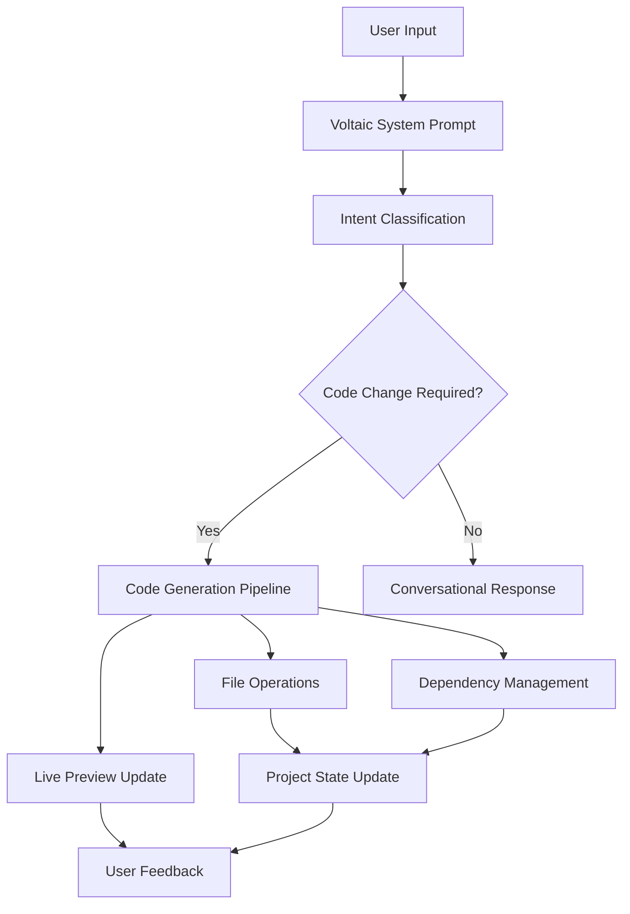

# Voltaic Development Roadmap

## Phase 1: Core System Implementation (Current Priority)

### 1.1 System Prompt Integration
- [x] **System Prompt Created** - Comprehensive Voltaic system prompt based on Lovable/v0 analysis
- [ ] **Integrate System Prompt** - Implement the system prompt into the AI generation pipeline
- [ ] **Test Basic Functionality** - Verify the system responds correctly to various request types

### 1.2 Code Block Parser & Executor
- [ ] **Voltaic Code Block Parser** - Create parser for `<voltaic-code>` blocks
- [ ] **File Operation Handlers** - Implement handlers for:
  - `<volt-write>` - Create/update files
  - `<volt-rename>` - Rename files
  - `<volt-delete>` - Delete files
  - `<volt-dependency>` - Install packages
- [ ] **Real-time Preview** - Live preview system like v0/Lovable
- [ ] **Error Handling** - Robust error handling for code operations

### 1.3 Project Management System    
- [ ] **Project Context** - Maintain project state across conversations
- [ ] **File System Management** - Track files, dependencies, and project structure
- [ ] **Version Control** - Basic versioning for project iterations
- [ ] **Project Templates** - Common starter templates for different app types

## Phase 2: Enhanced AI Capabilities

### 2.1 Multi-Agent Architecture
- [ ] **Idea Enhancement Agent** - Improve and expand user ideas
- [ ] **Architecture Planning Agent** - Design system architecture
- [ ] **Code Generation Agent** - Generate production-ready code
- [ ] **UI/UX Review Agent** - Ensure design standards compliance
- [ ] **Testing Agent** - Generate tests and validate functionality

### 2.2 Specialized Tools & Functions
```typescript
// Proposed tool functions based on competitor analysis
interface VoltaicTools {
  // Code Generation
  generateComponent(spec: ComponentSpec): ReactComponent;
  createApiRoute(endpoint: APISpec): NextJSRoute;
  generateDatabase(schema: DatabaseSchema): PrismaSchema;
  
  // UI/UX
  applyGlassMorphism(component: Component): StyledComponent;
  generateResponsiveLayout(breakpoints: Breakpoint[]): Layout;
  implementThemeSystem(themes: ThemeConfig): ThemeProvider;
  
  // Quality Assurance
  validateAccessibility(component: Component): AccessibilityReport;
  optimizePerformance(code: CodeBlock): OptimizedCode;
  generateTests(component: Component): TestSuite;
  
  // Project Management
  analyzeProject(codebase: Project): ProjectAnalysis;
  suggestImprovements(project: Project): Improvement[];
  deployToVercel(project: Project): DeploymentResult;
}
```

### 2.3 Knowledge Base & RAG
- [ ] **Voltaic Knowledge Base** - Curated knowledge of best practices
- [ ] **Component Library** - Pre-built, tested components
- [ ] **Pattern Library** - Common architectural patterns
- [ ] **RAG Integration** - Retrieve relevant knowledge for better responses

## Phase 3: Advanced Features

### 3.1 Collaboration Features
- [ ] **Project Sharing** - Share projects with team members
- [ ] **Real-time Collaboration** - Multiple users working on same project
- [ ] **Comments & Reviews** - Code review and feedback system
- [ ] **Export Options** - Export to GitHub, download ZIP, etc.

### 3.2 Deployment & DevOps
- [ ] **One-Click Deploy** - Deploy to Vercel/Netlify with single click
- [ ] **Environment Management** - Handle different environments (dev/staging/prod)
- [ ] **Domain Management** - Custom domain setup
- [ ] **Analytics Integration** - Built-in analytics and monitoring

### 3.3 Advanced AI Features
- [ ] **Visual Design Input** - Upload mockups/wireframes for code generation
- [ ] **Voice Commands** - Voice-to-code functionality
- [ ] **Natural Language Debugging** - Describe bugs in plain English
- [ ] **Performance Optimization** - AI-powered performance improvements

## Technical Architecture

### Backend Infrastructure


### Core Technologies Stack
- **AI Models**: GPT-4, Claude Sonnet (multi-model approach)
- **Backend**: Next.js API routes, Node.js
- **Database**: PostgreSQL with Prisma
- **File Storage**: Vercel Blob or AWS S3
- **Real-time**: WebSockets for live preview
- **Authentication**: NextAuth.js
- **Deployment**: Vercel for hosting

### Security Considerations
- **Code Sandboxing**: Execute generated code in isolated environments
- **Input Validation**: Sanitize all user inputs
- **Rate Limiting**: Prevent abuse of AI generation
- **Access Control**: Proper user permissions and project access
- **Data Privacy**: Secure handling of user projects and data

## Competitive Analysis Summary

### What We Learned from Lovable
- **Structured Code Blocks**: Clear separation of code vs conversation
- **Real-time Preview**: Users see changes immediately
- **Context Awareness**: Understand existing codebase before making changes
- **Tool Integration**: Specific tools for file operations
- **Quality Focus**: Emphasis on production-ready code

### What We Learned from v0
- **Component-First Approach**: Focus on reusable components
- **Design System Integration**: Built-in design system (shadcn/ui)
- **Multi-format Support**: MDX, diagrams, various code types
- **Accessibility Focus**: Built-in accessibility best practices
- **Modern Stack**: Latest Next.js, React, TypeScript

### Voltaic's Unique Value Proposition
- **Glass Morphism Design**: Distinctive visual style
- **MVP Focus**: Complete application generation, not just components
- **Navi's Expertise**: Proven track record with successful applications
- **Apple-like UX**: Superior user experience design
- **Full-Stack Scope**: Handle everything from frontend to deployment

## Success Metrics

### User Experience Metrics
- **Time to MVP**: From idea to deployable app
- **User Satisfaction**: Ratings and feedback scores
- **Adoption Rate**: User retention and growth
- **Code Quality**: Automated quality assessments

### Technical Metrics
- **Generation Speed**: Time to generate code
- **Success Rate**: Percentage of successful generations
- **Error Rate**: Failed operations and recovery
- **Performance**: Response times and system uptime

## Next Steps (Immediate Actions)

1. **Implement Core Parser** - Start with `<voltaic-code>` block parsing
2. **Basic File Operations** - Implement `<volt-write>` functionality
3. **Integration Testing** - Test with current AI generator interface
4. **User Testing** - Get feedback from early users
5. **Iterate & Improve** - Refine based on real usage

## Timeline Estimate

- **Phase 1**: 4-6 weeks (Core system)
- **Phase 2**: 8-10 weeks (Enhanced AI)
- **Phase 3**: 12-16 weeks (Advanced features)

**Total Estimated Timeline**: 6-8 months for full implementation

---

*This roadmap should be treated as a living document, updated based on user feedback, technical discoveries, and market changes.* 